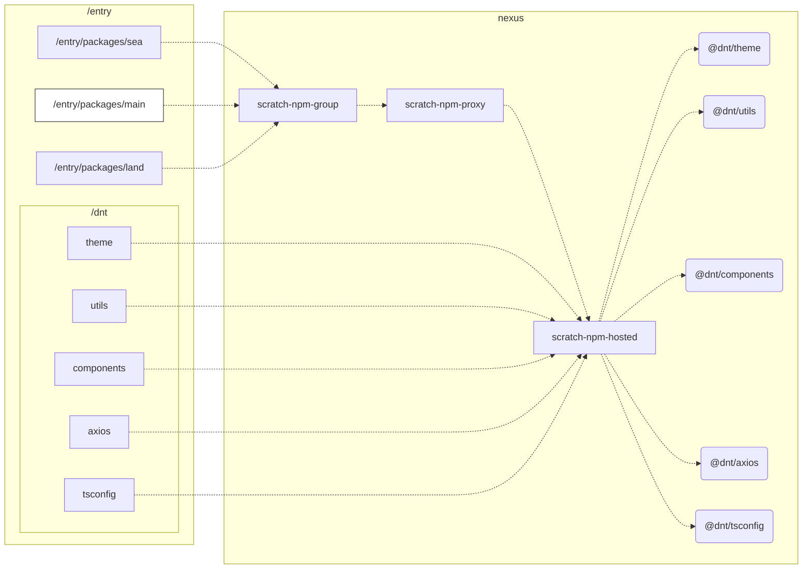

工程结构图


项目启动脚本
```bash
# 保存文件至本地 init.sh
# chmod 770 ./init.sh
# bash ./init.sh

mkdir scratch
cd ./scratch
scratch_dir=$(pwd)

cd $scratch_dir
pwd
git clone https://git.dnt.com.cn/smartmon/scratch/mic-server.git
cd ${scratch_dir}/mic-server

cd ./db
chmod 770 ./init.sh
./init.sh

cd ${scratch_dir}/mic-server
npm install


cd $scratch_dir
pwd
git clone https://git.dnt.com.cn/smartmon/scratch/entry.git
cd entry
git submodule init
git submodule update

nvm use stable
pnpm install

echo "启动server"
echo "新开一个窗口启动: nvm use stable && cd mic-server && npm redis:start"
echo "新开一个窗口启动: nvm use stable && cd mic-server && npm start"

echo "启动web"
echo "新开一个窗口启动: nvm use stable && cd entry && pnpm start"


```

ps： 如须查看工程结构图请在 vscode 插件市场 安装以下插件，右键打开侧边预览

https://github.com/shd101wyy/vscode-markdown-preview-enhanced.git
https://github.com/mjbvz/vscode-markdown-mermaid.git